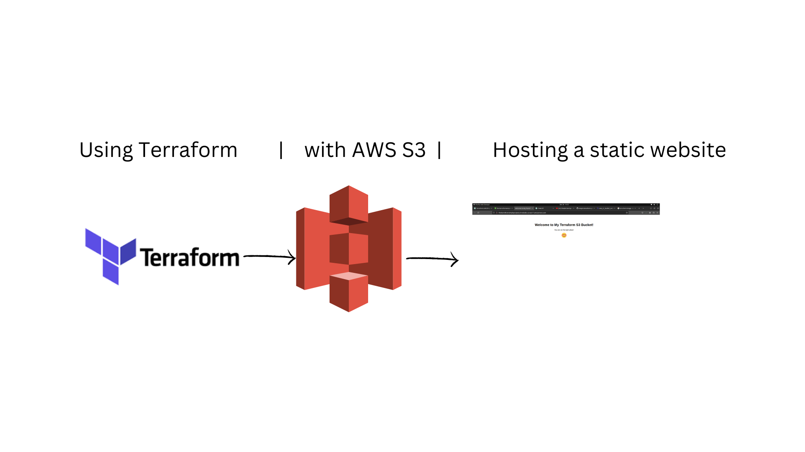

# Terraform AWS S3 Static Website Project

## Overview

This project demonstrates the use of Terraform to provision an AWS S3 bucket and deploy a simple static website. The infrastructure is defined as code, allowing for easy reproducibility and scalability.

## Project Structure

The project is organized into the following files:

- **`main.tf`**: Defines the AWS S3 bucket and its configuration.
- **`providers.tf`**: Specifies the required Terraform providers and versions.
- **`variables.tf`**: Contains variable declarations, allowing for customization.
- **`outputs.tf`**: Specifies outputs to be displayed after deployment.
- **`README.md`**: Provides project documentation and usage instructions.
- **`index.html` and `error.html`**: Basic HTML files for the static website.

## Usage

1. **Clone the Repository:**

   ```bash
   git clone https://github.com/prashant235913/Terraformproject.git
   cd Terraformproject
   ```

2. **Update Variables (Optional):**

   Open `variables.tf` and update the `bucketname` variable if you want to use a different S3 bucket name.

3. **Initialize Terraform:**

   ```bash
   terraform init
   ```

4. **Apply Changes:**

   ```bash
   terraform apply -auto-approve
   ```

5. **Deploy the Website:**

   Upload your website files (e.g., `index.html`, `error.html`) manually or use a deployment script.

6. **Access the Website:**

   After applying changes, the output will provide the website URL. Visit this URL in your web browser to view your static website.

7. **Cleanup (Optional):**

   If needed, run the following command to destroy the created resources:

   ```bash
   terraform destroy -auto-approve
   ```

## Project Diagram

You can find a visual representation of the project in the [project_diagram.png](./diagram) file. Open the file using an image viewer.



## Conclusion

This project serves as a foundational example for deploying a static website using Terraform and AWS S3. Feel free to customize and extend it based on your requirements.

For any additional questions or issues, please refer to the project documentation or contact the project maintainers.

Happy coding! 🚀
